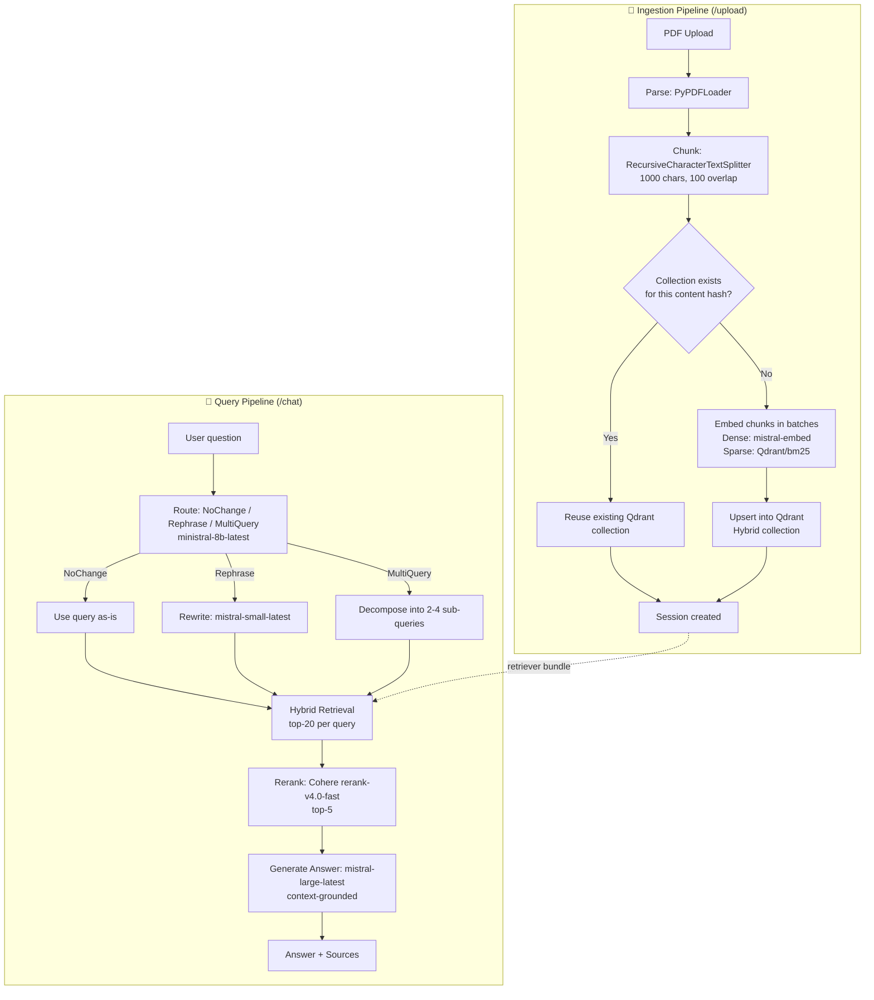

# Docent — Talk to any PDF

A production-style, async, hybrid-retrieval RAG chatbot. Upload any PDF, and ask it questions — grounded strictly in the document's content, with real (not simulated) pipeline progress and cited sources for every answer.

> **Stack:** FastAPI · LangChain · Mistral AI · Qdrant (hybrid dense + sparse) · Cohere Rerank · vanilla JS frontend

---

## Table of Contents

- [Overview](#overview)
- [Architecture](#architecture)
- [The RAG Pipeline in Detail](#the-rag-pipeline-in-detail)
  - [1. Ingestion Pipeline](#1-ingestion-pipeline)
  - [2. Query Pipeline](#2-query-pipeline)
  - [3. Query Routing](#3-query-routing)
  - [4. Hybrid Retrieval](#4-hybrid-retrieval)
  - [5. Reranking](#5-reranking)
  - [6. Answer Generation](#6-answer-generation)
- [Async Job Architecture](#async-job-architecture)
- [Model Configuration](#model-configuration)
- [API Reference](#api-reference)
- [Project Structure](#project-structure)
- [Environment Variables](#environment-variables)
- [Running Locally](#running-locally)
- [Deployment](#deployment)
- [Known Limitations](#known-limitations)

---

## Overview

Most "chat with your PDF" demos do naive single-vector similarity search and call it RAG. This project instead implements a **multi-stage retrieval pipeline** that mirrors how production RAG systems are actually built:

- **Query routing** — every question is classified before retrieval even starts, so vague or compound questions get rewritten/decomposed instead of silently returning bad results.
- **Hybrid search** — dense (semantic) + sparse (BM25/keyword) retrieval combined, not just cosine similarity on embeddings alone.
- **Cross-encoder reranking** — a second, more expensive but more accurate model re-scores retrieved candidates before they ever reach the LLM's context window.
- **Grounded generation** — the answer model is explicitly instructed to refuse to answer beyond what's in the retrieved context, with source attribution back to page numbers.
- **Real, staged progress reporting** — both ingestion and querying report actual pipeline stage/progress to the frontend (not a fake timed animation), via a polling job-status API.

---

## Architecture



**Both pipelines are exposed as async, pollable background jobs** — `POST /upload` and `POST /chat` return a `job_id` immediately, and the frontend polls `/upload/status/{job_id}` or `/chat/status/{job_id}` to render live stage-by-stage progress instead of a spinner.

---

## The RAG Pipeline in Detail

### 1. Ingestion Pipeline

| Stage | What happens | Reported progress |
|---|---|---|
| `parsing` | `PyPDFLoader` extracts text per page | 5% |
| `chunking` | `RecursiveCharacterTextSplitter` splits pages into overlapping chunks (`chunk_size=1000`, `chunk_overlap=100`) | 15–25% |
| `embedding` | Chunks embedded in ~10 batches (dense + sparse) and upserted into Qdrant incrementally, so progress reflects real work done | 25–90% |
| `storing` | Vector index finalized | 90–100% |
| `done` | Retriever built, chat session created | 100% |

**Deduplication by content hash.** Every uploaded PDF is SHA-256 hashed; the Qdrant collection is named `rag_{content_hash}`. If the exact same file content has already been indexed, the pipeline **skips re-embedding entirely** and reuses the existing collection — instant "upload" for repeat documents, and no wasted API calls to the embedding model.

### 2. Query Pipeline

Every chat message runs through five distinct, independently-reported stages:

```
routing → branching → retrieving → reranking → answering
```

Rather than one opaque LLM call, each stage is a separate, inspectable step — which is also what makes the real-time progress UI possible.

### 3. Query Routing

Before any retrieval happens, a lightweight router model (`ministral-8b-latest`) classifies the incoming question into exactly one of three categories:

| Label | Meaning | Action taken |
|---|---|---|
| `NoChange` | Query is already clear, specific, well-formed | Used as-is |
| `Rephrase` | Query is vague, too short, or missing keywords (e.g. *"tell me about that thing in section 2"*) | Rewritten into a single clearer, keyword-rich query by `mistral-small-latest` |
| `MultiQuery` | Query contains multiple sub-questions or a comparison (e.g. *"compare the warranty and refund policy, and who's eligible for support"*) | Decomposed into 2–4 diverse sub-queries by `mistral-small-latest`, each retrieved and answered independently |

This matters because a single embedding of a vague or compound question is a genuinely bad retrieval query — routing catches this *before* it silently degrades answer quality, instead of after.

All routing/rewriting/decomposition steps enforce structured output via Pydantic output parsers (`RouteOutput`, `ConditionalChainOutput`) — the LLM is constrained to return valid JSON matching an exact schema, not free text that needs fragile parsing.

### 4. Hybrid Retrieval

Each (possibly rewritten/decomposed) query is retrieved against Qdrant in **hybrid mode**:

- **Dense vectors** — `mistral-embed`, capturing semantic similarity
- **Sparse vectors** — `Qdrant/bm25` (via FastEmbed), capturing exact keyword/term overlap

This combination is deliberate: dense embeddings alone often miss exact terminology (model numbers, clause names, proper nouns) that a user's question quotes directly, while pure keyword search misses semantic paraphrases. Hybrid mode retrieves the top-20 candidates per query, combining both signals.

### 5. Reranking

The top-20 hybrid candidates are **not** sent directly to the LLM. Instead, they're passed through `CohereRerank` (`rerank-v4.0-fast`), a cross-encoder model that jointly scores each (query, passage) pair — far more precise than the bi-encoder similarity used for initial retrieval, but too expensive to run over the whole collection. This retrieve-then-rerank pattern narrows 20 candidates down to the **top 5** most relevant passages that actually go into the answer prompt.

### 6. Answer Generation

The final context is assembled from reranked passages and passed to `mistral-large-latest` under a strict system prompt that enforces:

- Answer **only** from the provided context — no outside knowledge
- Explicit refusal (`"I don't have enough information in the provided context to answer this question."`) rather than guessing when context is insufficient
- Flag conflicting information across chunks instead of silently picking one
- Markdown-formatted output (bold key terms, tables for comparisons, code blocks where relevant)
- Never fabricate sources, numbers, or citations

**Multi-query answers** (from the `MultiQuery` route) run this generation step once per sub-query, and the results are joined with `---` separators — so a compound question gets a structurally separated, complete answer for each part instead of one muddled response.

**Source attribution:** every reranked chunk that contributed to an answer is returned with its page number, rerank relevance score, and a text snippet, letting the frontend show exactly where each answer came from.

**Chat history:** prior turns are trimmed (`trim_messages`, max 7000 tokens, keeps most recent) before being passed into the router — so routing decisions are context-aware without unbounded prompt growth over a long conversation.

---

## Async Job Architecture

Both `/upload` and `/chat` are long-running operations (embedding calls, multiple LLM round-trips, reranking) — too slow to hold open a single HTTP request for. Instead:

1. `POST /upload` / `POST /chat` validate the request, spin up a **background thread**, and return `{job_id}` immediately.
2. The frontend polls `GET /upload/status/{job_id}` or `GET /chat/status/{job_id}` every 300–400ms.
3. Each pipeline stage reports its own progress via an `on_progress`/`on_stage` callback threaded all the way through `rag_pipeline.py`, giving the frontend **real** stage/percentage data — not a simulated timer.
4. The job only transitions to `stage: "done"` once *all* post-processing (session creation, chat history append) is complete — the pipeline's own internal completion signal is deliberately intercepted and remapped in `main.py` so a poller can never grab a `result` before it actually exists.

```python
JOBS: Dict[str, dict]              # job_id -> {stage, progress, message, result, error}
SESSIONS: Dict[str, dict]          # session_id -> {pdf_hash, filename, chat_history}
RETRIEVER_CACHE: Dict[str, ...]    # pdf_hash -> RetrieverBundle (base retriever + reranker)
```

---

## Model Configuration

| Role | Model | Purpose |
|---|---|---|
| Dense embeddings | `mistral-embed` | Semantic vector search |
| Sparse embeddings | `Qdrant/bm25` (FastEmbed) | Keyword/term-overlap search |
| Router | `ministral-8b-latest` | Fast query classification |
| Query rewriter | `mistral-small-latest` | Rephrase / multi-query generation |
| Answer generation | `mistral-large-latest` | Final grounded answer synthesis |
| Reranker | `rerank-v4.0-fast` (Cohere) | Cross-encoder relevance scoring |
| Vector store | Qdrant (hybrid mode) | Dense + sparse index |

All of these are surfaced live to the frontend via `GET /config`, so the UI's "model configuration" panel is never hardcoded — it reflects whatever's actually running server-side.

---

## API Reference

| Endpoint | Method | Description |
|---|---|---|
| `/health` | GET | Checks required env vars are set |
| `/config` | GET | Returns actual model identifiers in use |
| `/upload` | POST | Starts PDF ingestion, returns `{job_id}` |
| `/upload/status/{job_id}` | GET | Poll ingestion progress (`parsing → chunking → embedding → storing → done`) |
| `/chat` | POST | Starts answering a question, returns `{job_id}` |
| `/chat/status/{job_id}` | GET | Poll answer progress (`routing → branching → retrieving → reranking → answering → done`) |
| `/sessions/{id}/history` | GET | Fetch a session's chat history |
| `/sessions/{id}` | DELETE | Drop a session's in-memory state |

---

## Project Structure

```
.
├── main.py            # FastAPI app: routes, async job orchestration, CORS
├── rag_pipeline.py     # Core RAG logic: ingestion, routing, retrieval, rerank, generation
├── index.html          # Self-contained frontend (no build step)
├── requirements.txt
└── .env.example
```

---

## Environment Variables

| Variable | Required | Description |
|---|---|---|
| `MISTRAL_API_KEY` | Yes | Embeddings, routing, rewriting, answer generation |
| `COHERE_API_KEY` | Yes | Reranking |
| `QDRANT_API_KEY` | Yes | Vector store auth |
| `QDRANT_URL` | No | Defaults to a preconfigured Qdrant Cloud cluster |
| `CORS_ORIGINS` | No | Comma-separated allowed frontend origins (defaults to local dev + a placeholder) |

See `.env.example`.

---

## Running Locally

```bash
pip install -r requirements.txt
cp .env.example .env   # fill in your API keys
uvicorn main:app --reload --port 8000
```

Then open `index.html` in a local static server (e.g. VS Code Live Server) — it defaults to `http://127.0.0.1:8000` as the API base for local dev.

---

## Deployment

- **Backend:** Render (`uvicorn main:app --host 0.0.0.0 --port $PORT --workers 1`)
- **Frontend:** GitHub Pages (static, no build step)

> **Important:** the backend must run with a **single worker**. `JOBS`, `SESSIONS`, and `RETRIEVER_CACHE` are in-memory dicts — multiple worker processes would each have their own copy, causing random "unknown session" errors.

---

## Known Limitations

- **In-memory state** — sessions, jobs, and the retriever cache do not survive a process restart, and won't scale correctly across multiple worker processes or instances.
- **Ephemeral disk** — uploaded PDFs are stored on local disk; on platforms like Render's free tier, this is wiped on every restart/redeploy.
- **Cold starts** — all models and the Qdrant client are initialized at module import time; the first request after an idle period (e.g. Render free tier spin-down) will be noticeably slower.
- **No auth** — there is no user authentication or per-user isolation; any session ID is retrievable by anyone who has it.
